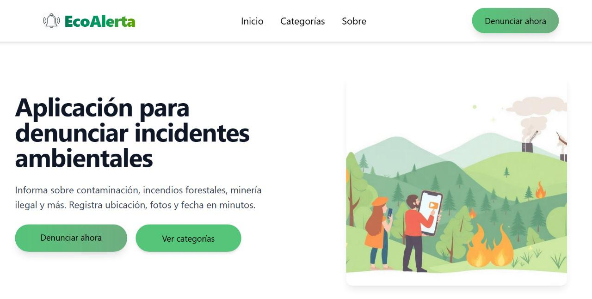
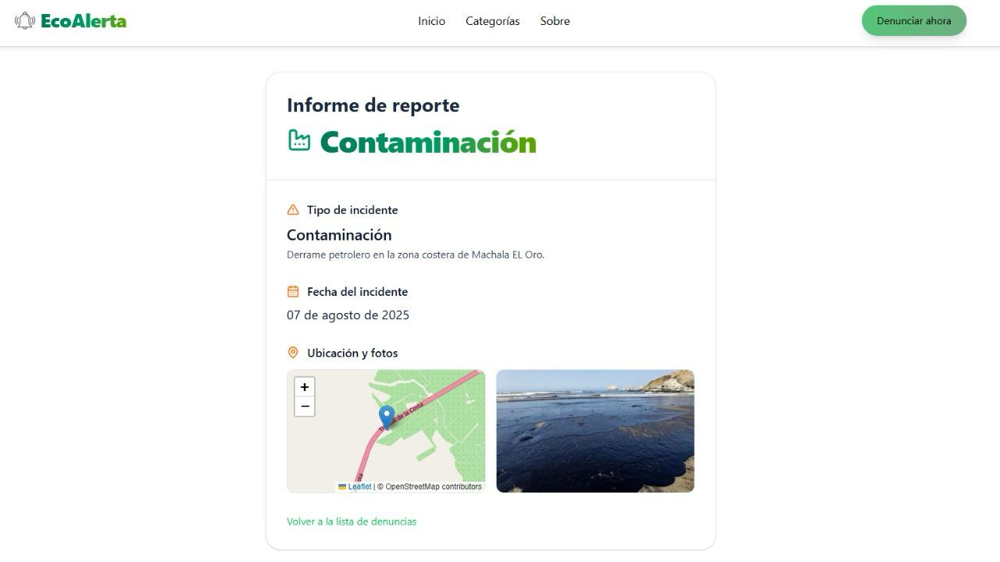
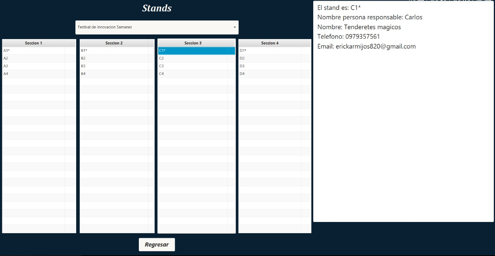
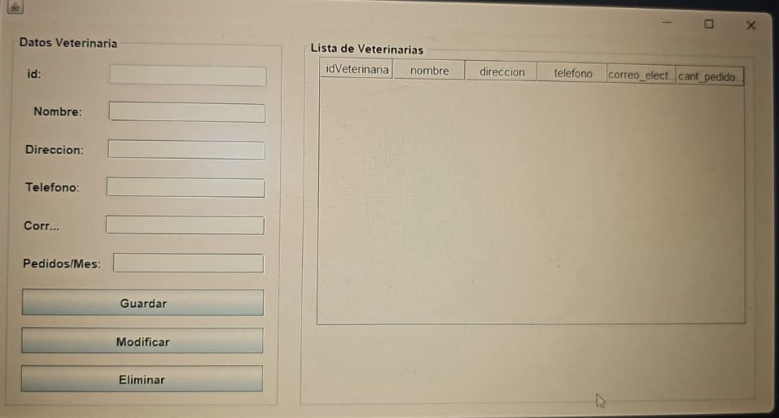
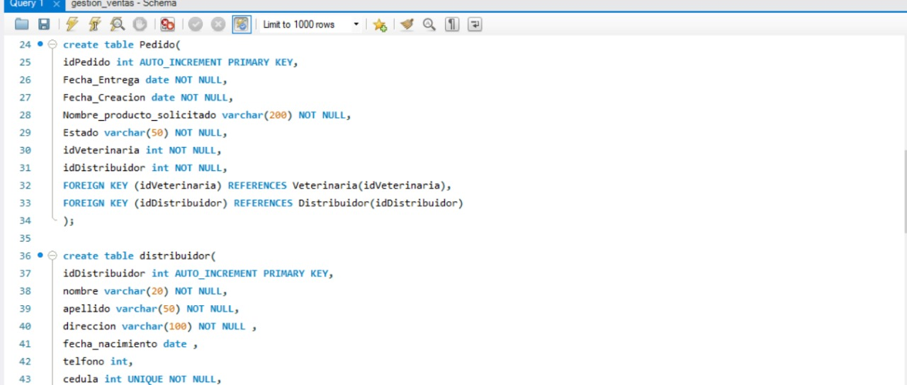

# Erick Danilo Armijos Romero 💻 - Repositorio Personal

---

## 🌟 Sobre mí
Soy estudiante de **Ingeniería de Software** interesado en el área de **videojuegos** y **desarrollo web**.  
📧 Correo institucional: edarmijo@espol.edu.ec  

- 🎯 **Objetivo:** Desarrollar soluciones innovadoras y aprender continuamente.  
- 💡 **Áreas de interés:** Desarrollo web, videojuegos, apps interactivas.

---

## 🛠 Habilidades
| Lenguajes | Frameworks / Librerías | Herramientas | Otros |
|-----------|----------------------|-------------|-------|
| Python, C, Java, PHP, JavaScript | React, Node.js, Tailwind, TailwindCSS | Git, GitHub, VSCode, NetBeans, Unity, Jupyter | Bases de datos MySQL |

---

## 📂 Proyectos

<strong>Proyecto 01 – Sistema de Gestión de Denuncias Ambientales</strong> 🔗

- **Estado:** Finalizado  
- **Tecnologías:** React, Node.js, PHP, TailwindCSS  
- **Descripción:** Desarrollo de una plataforma web intuitiva que permite a los ciudadanos reportar denuncias ambientales en tiempo real, promoviendo la participación ciudadana en la protección del medio ambiente.  
- **Repositorio:** [GitHub](https://github.com/kimi2123/ecoAlerta)  

**Evidencias:**  
  
  

<strong>Proyecto 02 – Sistema de Gestión de Stands para una Feria de Emprendimientos</strong> 🔗

- **Estado:** Finalizado  
- **Tecnologías:** Java, JavaFX  
- **Descripción:** Aplicación de escritorio que administra la participación de emprendedores en una feria. Permite registrar emprendedores, asignar stands, gestionar auspiciantes y secciones de la feria, así como vincular redes sociales a los participantes.  
- **Repositorio:** [GitHub](https://github.com/Ricardo24A/POO-P3-G07)  

**Evidencias:**  
  
  
  

<strong>Proyecto 03 – Sistema de Administración de Artículos Veterinarios</strong> 🔗

- **Estado:** Finalizado  
- **Tecnologías:** Java (Swing), MySQL  
- **Descripción:** Aplicación de escritorio que gestiona artículos y procesos de una veterinaria. Incluye módulos para administrar distribuidores, productos, pedidos y facturas, con formularios de registro y consulta.  
- **Base de datos:** MySQL utilizada para almacenar información de clientes, productos, pedidos y facturas.  
- **Repositorio:** [GitHub](https://github.com/kimi2123/ProyectoSistemasDeBasesDeDatos)  

**Evidencias:**  
  
  

---

## 🔗 Contacto
- 📧 Correo institucional: edarmijo@espol.edu.ec  
- 🌐 GitHub: [https://github.com/kimi2123]((https://github.com/kimi2123))  
- 💼 LinkedIn: [https://www.linkedin.com/in/erick-danilo-armijos-romero-84a348277/](https://www.linkedin.com/in/erick-danilo-armijos-romero-84a348277/)
