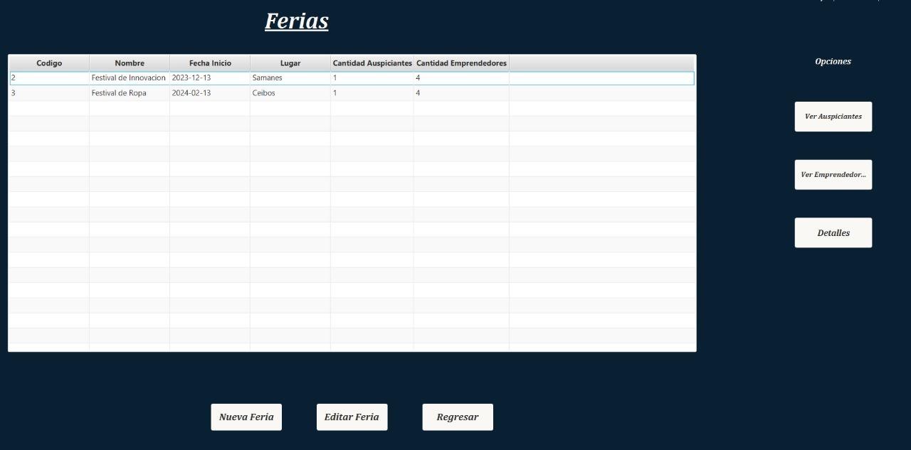

# Erick Danilo Armijos Romero 💻 - Repositorio Personal

---

## 🌟 Sobre mí
Soy estudiante de **Ingeniería de Software** interesado en el área de **videojuegos** y **desarrollo web**.  
📧 Correo institucional: edarmijo@espol.edu.ec  

- 🎯 **Objetivo:** Desarrollar soluciones innovadoras y aprender continuamente.  
- 💡 **Áreas de interés:** Desarrollo web, videojuegos, apps interactivas.

---

## 🛠 Tecnologías y Herramientas Aprendidas

- **Lenguajes:** Python, C, Java, PHP, JavaScript  
- **Frameworks / Librerías:** React, Node.js, Tailwind, TailwindCSS  
- **Herramientas:** Git, GitHub, VSCode, NetBeans, Unity, Jupyter  
- **Bases de datos:** MySQL  

---

## 📂 Proyectos

### Proyecto 01 – Sistema de Gestión de Denuncias Ambientales
- **Estado:** Finalizado  
- **Tecnologías:** React, Node.js, PHP, TailwindCSS  
- **Descripción:** Plataforma web que permite reportar denuncias ambientales en tiempo real.  
- **Repositorio:** [GitHub](https://github.com/kimi2123/ecoAlerta)  

**Evidencias:**  
  
  

---

### Proyecto 02 – Sistema de Gestión de Stands para una Feria de Emprendimientos
- **Estado:** Finalizado  
- **Tecnologías:** Java, JavaFX  
- **Descripción:** Administra la participación de emprendedores en una feria, asigna stands y gestiona auspiciantes.  
- **Repositorio:** [GitHub](https://github.com/Ricardo24A/POO-P3-G07)  

**Evidencias:**  
  
  
  

---

### Proyecto 03 – Sistema de Administración de Artículos Veterinarios
- **Estado:** Finalizado  
- **Tecnologías:** Java (Swing), MySQL  
- **Descripción:** Gestiona artículos y procesos de una veterinaria: distribuidores, productos, pedidos y facturas.  
- **Repositorio:** [GitHub](https://github.com/kimi2123/ProyectoSistemasDeBasesDeDatos)  

**Evidencias:**  
  
  

---

## 🔗 Contacto
- 📧 Correo institucional: edarmijo@espol.edu.ec  
- 🌐 GitHub: [https://github.com/kimi2123](https://github.com/kimi2123)  
- 💼 LinkedIn: [https://www.linkedin.com/in/erick-danilo-armijos-romero-84a348277/](https://www.linkedin.com/in/erick-danilo-armijos-romero-84a348277/)
