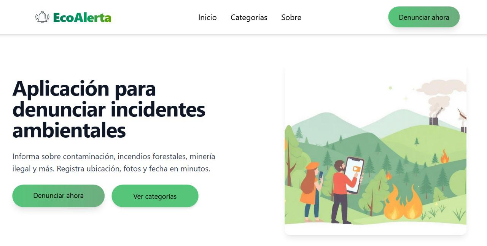
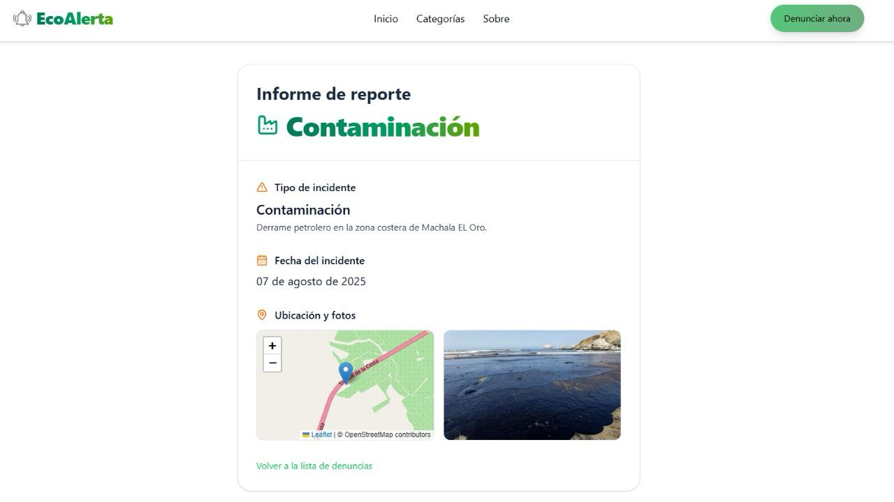
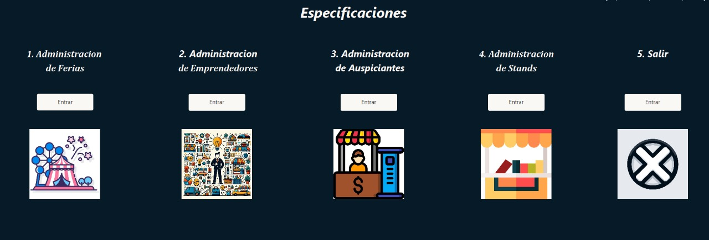
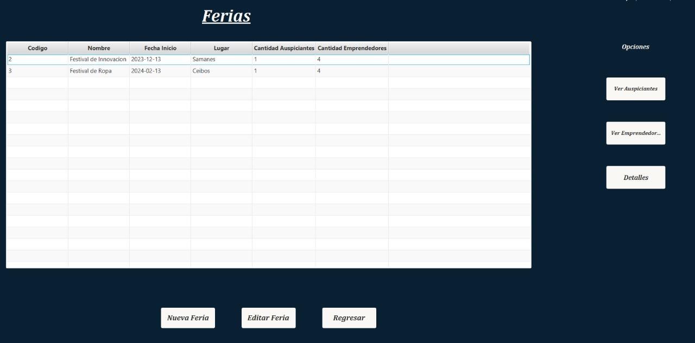
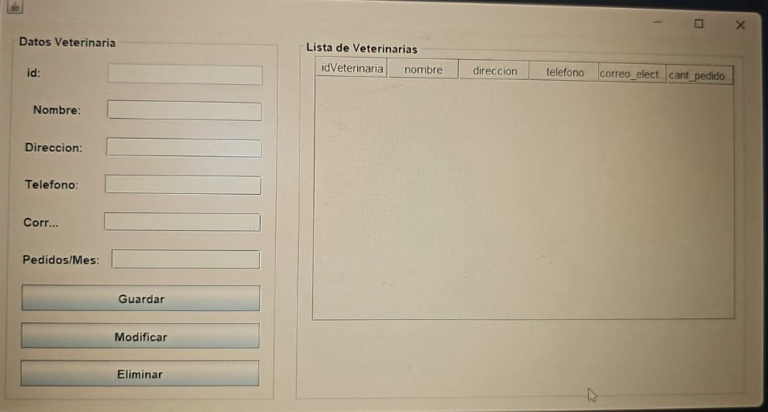
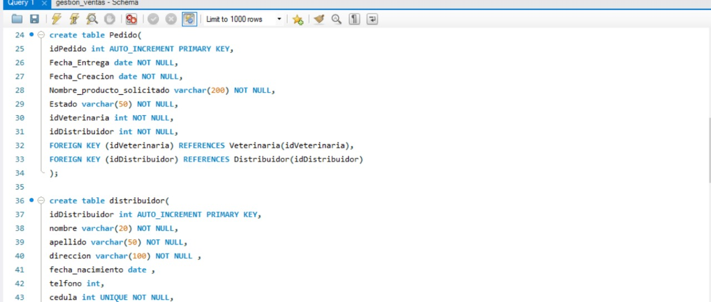

# Erick Danilo Armijos Romero - Repositorio Personal

## Sobre mí
Soy estudiante de Ingeniería de Software interesado en el area de videouegos y desarrollo web.  
Correo institucional: edarmijo@espol.edu.ec

---

## Habilidades
- Lenguajes de programación:  Python, C, Java, PHP, JavaScript.
- Frameworks / Librerías: React, Node.js, Tailwind, TaildwindCSS.
- Herramientas: Git, GitHub, VSCode, Neatbeans, Unity, Jupiter.
- Otros conocimientos relevantes: Conocimiento relacionado con bases de datos como MySQL.

---

## Proyectos
### [Proyecto 01 – Sistema de Gestión de Denuncias Ambientales](https://github.com/kimi2123/ecoAlerta)
- *Estado:* Finalizado
- *Tecnologías:* React, Node.js, PHP, TailwindCSS
- *Descripción:*  Desarrollo de una plataforma web intuitiva que permita a los ciudadanos reportar denuncias ambientales en tiempo real, promoviendo la participación ciudadana en la protección del medio ambiente.
- **Evidencias:**  
  
  

### [Proyecto 02 – Sistema de Gestión de Stands para una Feria de Emprendimientos](https://github.com/Ricardo24A/POO-P3-G07)
- *Estado:* Finalizado 
- *Tecnologías:* Java, JavaFX  
- *Descripción:* Aplicación de escritorio que administra la participación de emprendedores en una feria.  
  Permite registrar emprendedores, asignar stands, gestionar auspiciantes y secciones de la feria, así como vincular redes sociales a los participantes.
  **Evidencias:**  
  

  

### [Proyecto 03 – Sistema de Administración de Artículos Veterinarios](https://github.com/kimi2123/ProyectoSistemasDeBasesDeDatos)
- *Estado:* Finalizado
- *Tecnologías:* Java (Swing), MySQL  
- *Descripción:* Aplicación de escritorio que gestiona artículos y procesos de una veterinaria. Incluye módulos para administrar distribuidores, productos, pedidos y facturas, con formularios de registro y consulta.  
- *Base de datos:* MySQL utilizada para almacenar información de clientes, productos, pedidos y facturas.
- **Evidencias:**  
  
  

## GitHub Pages
